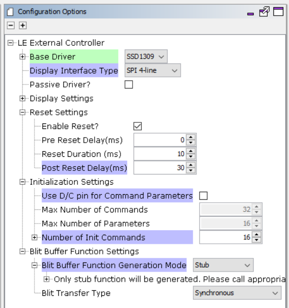

 legato\_qs\_pic32cm\_le00\_cpro\_oled.X

Defining the Architecture
-------------------------

This application demonstrates Legato Graphics Library driving a monochrome OLED display.

The Legato library draws monochrome pixel data to a frame buffer in SRAM, and the frame buffer is sent to the external SSD1309 controller to update the OLED display.

### Demonstration Features 

* Legato Graphics Library 
* SSD1309 display controller driver 
* 4-line SPI display interface driver 
* Time system service, timer-counter peripheral library and driver 
* Monochrome color depth support 

Creating the Project Graph
--------------------------

The Project Graph diagram shows the Harmony components that are included in this application. Lines between components are drawn to satisfy components that depend on a capability that another component provides.

The LE External Display Controller component is configured for the SSD1309 Base Driver and generates the driver for the SSD1309 display controller that is on the OLED Curiosity Extension Board.

Building the Application
------------------------

The parent directory for this application is apps/legato_quickstart. To build this application, use MPLAB X IDE to open the apps/legato_quickstart/firmware/legato_qs_pic32cm_le00_cpro_oled.X  project file. 

The following table lists configuration properties: 

| Project Name  | BSP Used |Graphics Template Used | Description |
|---------------| ---------|---------------| ---------|
| legato_qs_pic32cm_le00_cpro_oled.X | PIC32CM LE00 Curiosity Pro BSP | None  | [PIC32CM LE00 Curiosity Pro Evaluation Kit](https://www.microchip.com/en-us/development-tool/EV80P12A) with the [OLED Curiosity Extension Board](https://www.microchip.com/oled) |

> \*\*\_NOTE:\_\*\* This application may contain custom code that is marked by the comments // START OF CUSTOM CODE ... and // END OF CUSTOM CODE. When using the MPLAB Harmony Configurator to regenerate the application code, use the "ALL" merging strategy and do not remove or replace the custom code.

Configuring the Hardware
------------------------

The OLED Curiosity Extension board is connected to the EXT3 header on the PIC32CM LE00 Curiosity Pro board. The final setup should be: 

Running the Demonstration
-------------------------

When power-on is successful, the demonstration will display a similar screen to that shown below.

* * * * *
