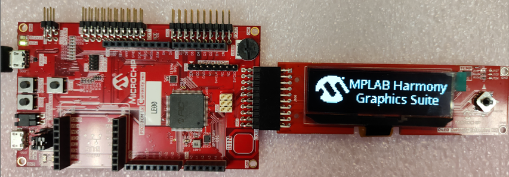

# Legato Quickstart

This demonstration provides a starting point for running the legato graphics library on the PIC32CM Lx MCUs

|MPLABX Configuration|Board Configuration|
|:-------------------|:------------------|
| [legato\_qs\_pic32cm\_le00\_cpro\_oled.X](./firmware/legato_qs_pic32cm_le00_cpro_oled.X/readme.md) | [PIC32CM LE00 Curiosity Pro Evaluation Kit](https://www.microchip.com/en-us/development-tool/EV80P12A) with the [OLED Curiosity Extension Board](https://www.microchip.com/oled) |