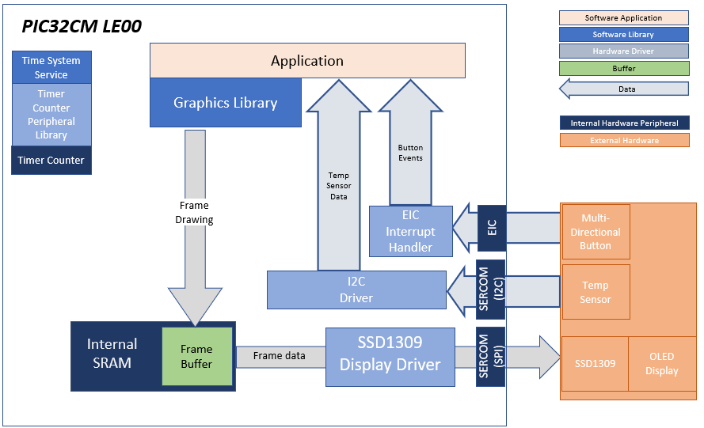
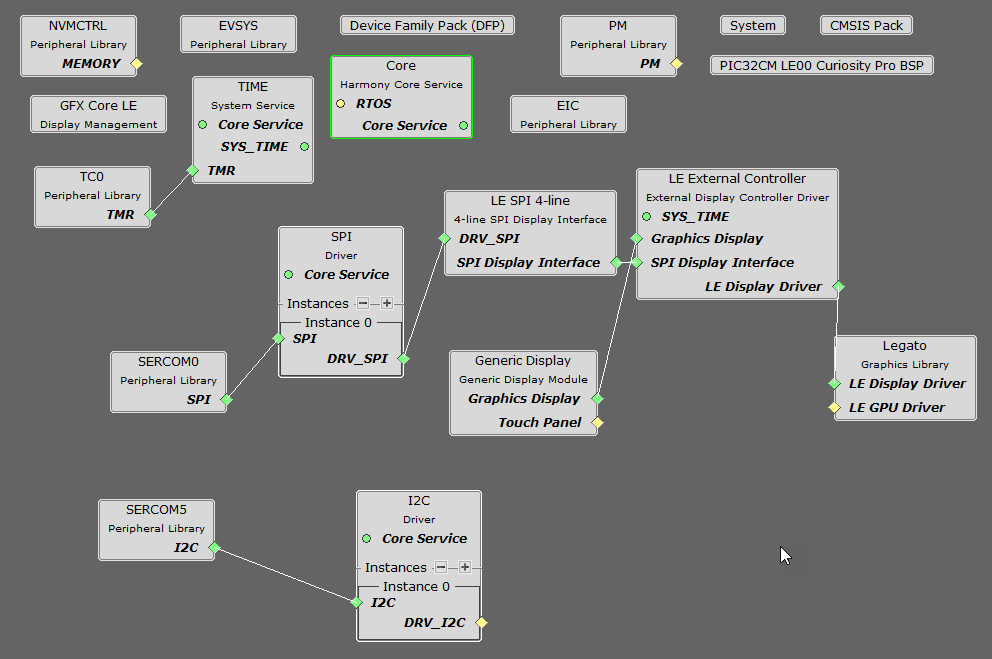
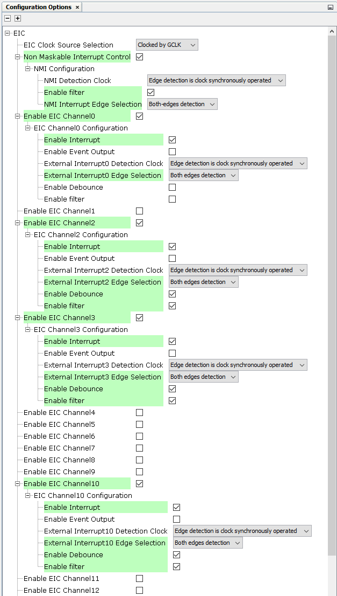
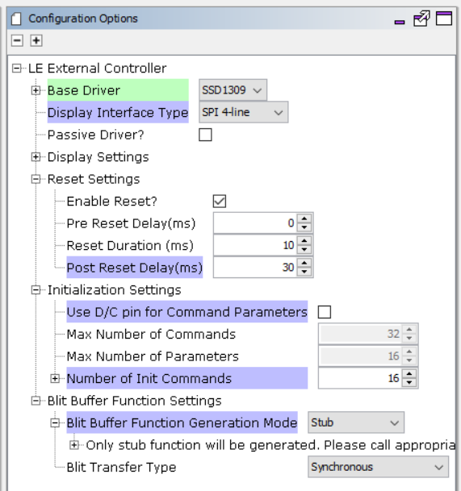
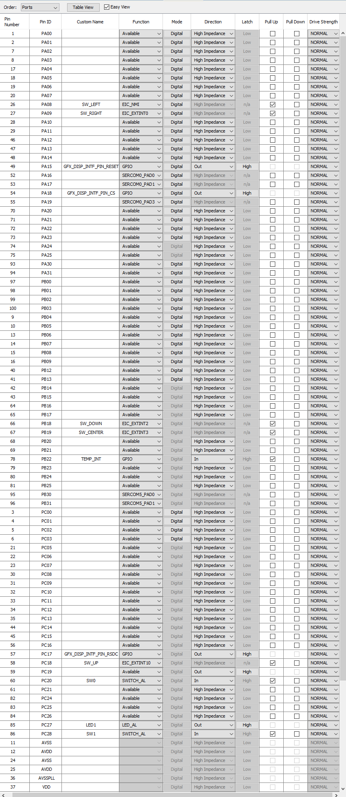
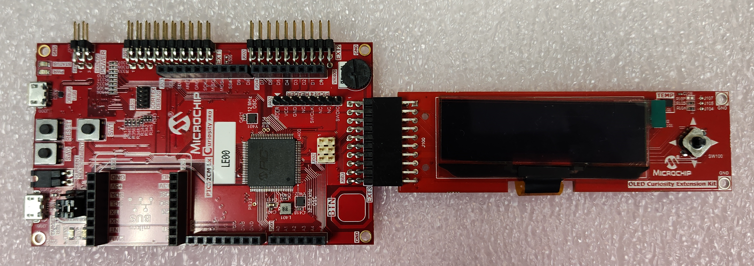
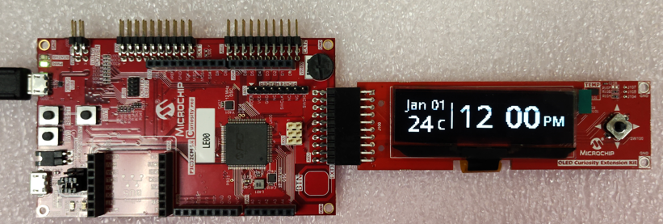
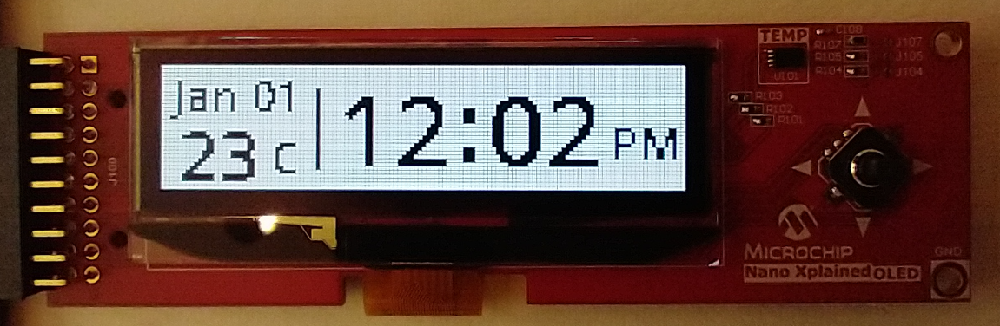
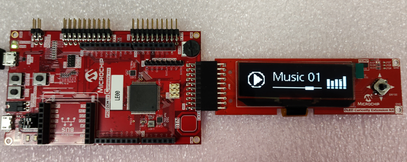

 legato\_sc\_pic32cm\_le00\_cpro\_oled.X

Defining the Architecture
-------------------------

This application demonstrates the different features of the OLED Curiosity Extension Board with Harmony 3 and the Legato Graphics Library. It showcases simple clock/thermostat and music player user interfaces on a monochrome display. Temperature data from the on-board temperature sensor on the OLED Curiosity Extension board is read by the MCU and displayed on the screen. The demo accepts user input thru the multi-directional button switch that is also on the OLED Curiosity Extension Board.

The Legato library draws the monochrome frame to a buffer in SRAM, and the frame buffer is sent to the external SSD1309 controller to update the OLED display.

### Demonstration Features 

* Legato Graphics Library 
* SSD1309 OLED display controller driver 
* 4-line SPI display interface driver 
* Time system service, timer-counter peripheral library and driver 
* Monochrome display
* Temperature Sensor
* Multi-directional switch

Creating the Project Graph
--------------------------

The Project Graph diagram shows the Harmony components that are included in this application. Lines between components are drawn to satisfy components that depend on a capability that another component provides.

The EIC is configured to generate interrupts for user input thru the multi-directional switch. 

Sercom6 and I2C driver are used to communicate with the temperature sensor and fetch temperature data.

The LE External Display Controller component is configured for the SSD1309 Base Driver and generates the driver for the SSD1309 display controller that is on the OLED Curiosity Extension Board. The driver uses the 4-line SPI display interface to configure and send frame buffer data to the display controller.

The pins used by these peripherals are configured in the MHC Pin Configuration Tool.

Building the Application
------------------------

The parent directory for this application is apps/legato_oled_showcase. To build this application, use MPLAB X IDE to open the apps/legato_oled_showcase/firmware/legato_sc_e54_cult_oled.X project file. 

The following table lists configuration properties: 

| Project Name  | BSP Used |Graphics Template Used | Description |
|---------------| ---------|---------------| ---------|
| legato_sc_pic32cm_le00_cpro_oled.X | PIC32CM LE00 Curiosity Pro BSP | None  | PIC32CM LE00 Curiosity Pro with OLED Curiosity Extension Board via SPI |

> \*\*\_NOTE:\_\*\* This application may contain custom code that is marked by the comments // START OF CUSTOM CODE ... and // END OF CUSTOM CODE. When using the MPLAB Harmony Configurator to regenerate the application code, use the "ALL" merging strategy and do not remove or replace the custom code.

Configuring the Hardware
------------------------

The OLED Curiosity Extension board is connected to the EXT3 header on the PIC32CM LE00 Curiosity Pro board. The final setup should be: 

Running the Demonstration
-------------------------

When power-on is successful, the demonstration will display a the clock/thermostat UI screen as shown in the figure below. 

Pressing the multi-directional switch on the OLED Extension Board to the LEFT or RIGHT direction will adjust the clock. 

The temperature label on the screen will update based on the data received from the temperature sensor. It will also periodically toggle the value between Celsius and Fahrenheit.

Pressing the CENTER switch will switch the display from normal to inverted color.

Pressing the switch to the DOWN direction will show the music player UI. In the music player UI, pressing the switch at the CENTER position will also toggle the UI controls between Paused and Playing.

Pressing the switch to the UP direction will turn on vertical scrolling for the OLED display. 

Pressing the switch to any other direction will stop the scrolling. Scrolling will also automatically start after 20 seconds of idle time.

* * * * *
